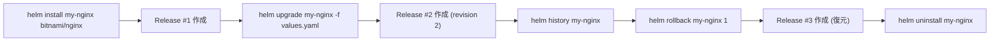

# 🧭 Chapter 1: Helm の基本操作 Hands-on

Helm の基礎を実際に体験して理解を深めます。  
この章では `helm install`, `helm upgrade`, `helm rollback`, `helm uninstall` を順に実行します。

---

## 🎯 目標
- Helm Chart を使ったデプロイの基本を体感する  
- Release（リリース）の概念とリビジョン管理を理解する  
- `helm status`, `helm history` などの確認コマンドを試す

---

## 🧩 前提
- `setup/setup_helm_with_kind.md` で Helm 環境をセットアップ済み  
- kind クラスタ (`helm-lab`) が起動している  
- Helm コマンドが利用可能（`helm version` が成功する）

---

## Step 1. Nginx を Helm Chart でインストール

まず、Bitnami リポジトリを確認・更新してから `nginx` Chart をインストールします。

```bash
helm repo list
helm repo update

# nginx Chart の検索
helm search repo nginx

# インストール (release名: my-nginx)
helm install my-nginx bitnami/nginx
```

### 確認
```bash
helm list
kubectl get pods
kubectl get svc my-nginx
```

### 出力例
```bash
NAME      	NAMESPACE	REVISION	STATUS  	CHART       	APP VERSION
my-nginx  	default  	1       	deployed	nginx-15.5.2	1.27.0
```
```bash
NAME                        READY   STATUS    RESTARTS   AGE
my-nginx-6bccb98799-q4q8j   1/1     Running   0          66s
```
```bash
NAME       TYPE           CLUSTER-IP    EXTERNAL-IP   PORT(S)                      AGE
my-nginx   LoadBalancer   XX.XX.XX.XX   <pending>     80:30619/TCP,443:31229/TCP   49s
```

## Step 2. 状態を確認する
Helm では「Release」単位で状態を管理します。
helm status と helm get コマンドを試してみましょう。
```bash
helm status my-nginx
helm get all my-nginx
```

主要な確認ポイント：
- STATUS: deployed
- REVISION: 1

## Step 3. values.yaml を使ってカスタマイズ
まず、デフォルト値を取得します。
```bash
helm show values bitnami/nginx > custom-values.yaml
```

この中で service.type を NodePort に変更します：
```yaml
service:
  type: NodePort
```

変更を反映：
```bash
helm upgrade my-nginx bitnami/nginx -f custom-values.yaml
```

再確認：
```bash
helm status my-nginx
kubectl get svc my-nginx
```

主要な確認ポイント：
- STATUS: deployed
- REVISION: 2
```bash
NAME       TYPE       CLUSTER-IP    EXTERNAL-IP   PORT(S)                      AGE
my-nginx   NodePort   XX.XX.XX.XX   <pending>     80:30619/TCP,443:31229/TCP   49s
```

## Step 4. Rollback を試す
変更前の状態に戻したい場合は、helm rollback を使用します。
### 履歴を確認
```bash
helm history my-nginx
```

### ロールバック実行
```bash
helm rollback my-nginx 1
```

### 状態再確認
```bash
helm status my-nginx
kubectl get svc my-nginx
```
主要な確認ポイント：
- STATUS: deployed
- REVISION: 3
```bash
NAME       TYPE           CLUSTER-IP    EXTERNAL-IP   PORT(S)                      AGE
my-nginx   LoadBalancer   XX.XX.XX.XX   <pending>     80:30619/TCP,443:31229/TCP   49s
```


✅ Helm は自動的に revision 番号をインクリメントして履歴を保持します。
Rollback 後も「前の構成に戻す」だけであり、履歴は残り続けます。

## Step 5. リリースを削除
```bash
helm uninstall my-nginx
```
確認：
```bash
helm list
kubectl get all
```

## まとめ
| コマンド       | 概要                              |
| -------------- | --------------------------------- |
| helm install   | Chart をデプロイし Release を作成 |
| helm upgrade   | 既存 Release を更新               |
| helm status    | リリース状態を確認                |
| helm history   | 過去リビジョンを参照              |
| helm rollback  | 指定リビジョンに戻す              |
| helm uninstall | リリースを削除 |

## 補足図：Helm 操作フロー
