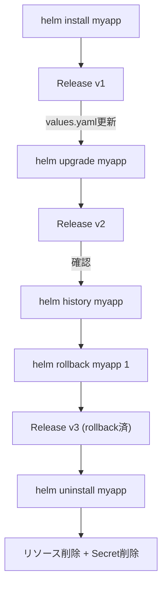

# ⚙️ Chapter 3: Helm の基本コマンド操作 Hands-on

この章では、Helm の代表的なコマンド操作を実際に試しながら、  
Release のライフサイクルを理解します。

---

## 🎯 目標
- `helm install` / `helm upgrade` / `helm rollback` / `helm uninstall` の挙動を体感する  
- `helm template` と `helm install --dry-run` の違いを理解する  
- `helm history` によるリビジョン管理を確認する  
- Chart の依存関係管理（`Chart.yaml` の `dependencies:`）を実際に動かす

---

## 🧩 前提
- kind クラスタ (`helm-lab`) が起動している  
- 第2章で作成した `mychart/` ディレクトリが存在する

---

## Step 1. Helm install の挙動を理解する

まずはおさらいとして、自作チャートをデプロイします。

```bash
helm install myapp ./mychart
```

確認：
```bash
helm list
helm status myapp
```

出力例：
```bash
NAME  	NAMESPACE	REVISION	STATUS  	CHART      	APP VERSION
myapp	default  	1       	deployed	mychart-0.1.0	1.0
```

Helm はこのとき、テンプレートを展開（render）して Kubernetes API に送信し、
結果を Release（Secretリソース） としてクラスタに保存します。

## Step 2. helm template と helm install --dry-run の違いを確認
helm template は、Kubernetes に適用せず ローカルでレンダリングだけ行う コマンドです。
```bash
helm template ./mychart
```

結果：標準出力に YAML が出力されます。

--dry-run は「実際に API に送らず、install 処理をシミュレートする」モードです。
```bash
helm install myapp ./mychart --dry-run
```

| コマンド               | リソース作成 | Helm Release 保存 | 出力     |
| ---------------------- | ------------ | ----------------- | -------- |
| helm template          | ❌ しない    | ❌ 保存しない     | YAMLのみ |
| helm install --dry-run | ❌ しない    | ❌ 保存しない     | YAML＋Hook情報 |

## Step 3. helm upgrade と helm history
Chart の設定を変更してアップグレードを試します。

values.yaml の変更
```yaml
replicaCount: 2
```

アップグレード実行：
```bash
helm upgrade myapp ./mychart
```

確認：
```bash
helm list
helm history myapp
kubectl get pods
```

出力例：
```yaml
REVISION	UPDATED                 	STATUS  	CHART      	DESCRIPTION
1        	2025-10-16 20:00:00 JST	deployed	mychart-0.1.0	Install complete
2        	2025-10-16 20:02:00 JST	deployed	mychart-0.1.0	Upgrade complete
```

## Step 4. helm rollback で以前の状態に戻す
```bash
helm rollback myapp 1
```
再確認：

```bash
helm status myapp
helm history myapp
```

出力例：
```bash
REVISION	UPDATED                 	STATUS  	CHART      	DESCRIPTION
3        	2025-10-16 20:05:00 JST	deployed	mychart-0.1.0	Rollback to 1
```

✅ Helm は「元に戻す」操作でも新しい revision を発行します。
つまり「revision 3」が「revision 1 の状態」に戻った、という意味です。

## Step 5. helm uninstall で削除
```bash
helm uninstall myapp
```

確認：
```bash
helm list
kubectl get all
```

Release 情報（Secret）も削除されます。

## Step 6. Chart の依存関係を扱う（Subchart）
### 依存関係を定義
mychart/Chart.yaml に追記します：
```yaml
dependencies:
  - name: redis
    version: 17.9.0
    repository: https://charts.bitnami.com/bitnami
```

依存関係を取得：
```bash
helm dependency update mychart
```

結果：
```bash
Saving 1 charts
Downloading redis from repo https://charts.bitnami.com/bitnami
```

確認：
```bash
mychart/charts/redis-17.9.0.tgz
```

再デプロイ：
```bash
helm install myapp ./mychart
```

redis サブチャートも自動的にデプロイされます。

## Step 7. helm get で内部構造を確認
```bash
helm get all myapp
```
表示内容：
- values: 現在の設定値
- manifest: Kubernetes に送られた YAML
- notes: Chart の説明文

## まとめ
| コマンド               | 役割                           |
| ---------------------- | ------------------------------ |
| helm install           | 新しい Release を作成          |
| helm upgrade           | 設定変更を反映                 |
| helm rollback          | 過去のリビジョンに戻す         |
| helm uninstall         | リリースを削除                 |
| helm history           | リビジョン履歴を表示           |
| helm template          | YAMLをローカル出力（適用なし） |
| helm dependency update | Subchart を取得 |

## 補足図：Release ライフサイクル
