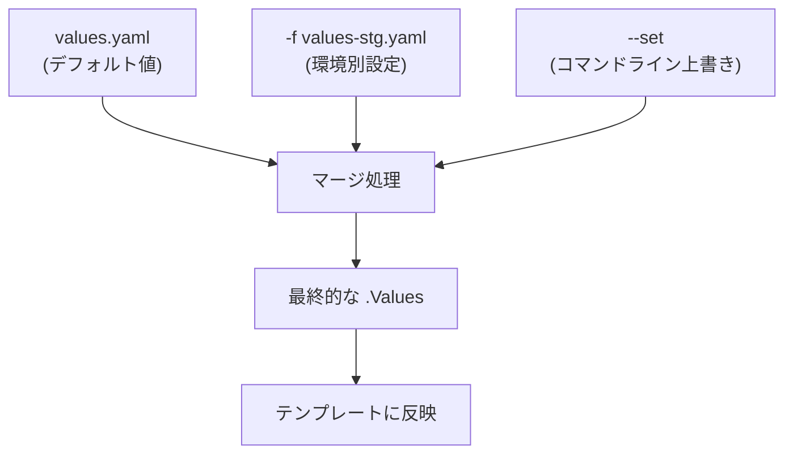

# 🌐 Chapter 4: Values ファイルと環境ごとの設定管理 Hands-on

この章では、複数の環境（開発・検証・本番）で異なる設定を持つアプリを  
Helm の `values.yaml`、`-f`、`--set` オプションを使って管理する方法を学びます。

---

## 🎯 目標
- `values.yaml` を環境ごとに分離する  
- `-f` で複数 values ファイルを適用する  
- `--set` と `-f` を併用した優先順位を理解する  
- 設定値のマージ結果を `helm get values` で確認する  

---

## 🧩 前提
- kind クラスタ (`helm-lab`) が起動している  
- 第3章で作成した `mychart/` が存在する  
- Chart が `image`, `service`, `replicaCount` などの値を持っている

---

## Step 1. 環境別 Values ファイルを準備
mychart/values-dev.yaml:
```yaml
replicaCount: 1
service:
  type: NodePort
  nodePorts:
    http: 30080
image:
  tag: "1.27.1-dev"
```

mychart/values-stg.yaml:
```yaml
replicaCount: 2
service:
  type: ClusterIP
image:
  tag: "1.27.1-stg"
```

mychart/values-prod.yaml:
```yaml
replicaCount: 3
service:
  type: LoadBalancer
image:
  tag: "1.27.1-prod"
```

## Step 2. dev 環境としてデプロイ
```bash
helm install myapp ./mychart -f mychart/values-dev.yaml
```

確認：
```bash
helm get values myapp
kubectl get svc myapp
```

出力例：
```yaml
USER-SUPPLIED VALUES:
replicaCount: 1
service:
  type: NodePort
image:
  tag: 1.27.1-dev
```

## Step 3. stg 環境への切り替え（upgrade）
```bash
helm upgrade myapp ./mychart -f mychart/values-stg.yaml
```

確認：
```bash
helm status myapp
kubectl get pods
```

出力例：
```yaml
replicas: 2
image: nginx:1.27.1-stg
service type: ClusterIP
```

## Step 4. -f と --set の併用を試す
stg 設定をベースに、一部を上書きしてみます。
```bash
helm upgrade myapp ./mychart \
  -f mychart/values-stg.yaml \
  --set replicaCount=4 \
  --set image.tag=1.27.1-hotfix
```

確認：
```bash
helm get values myapp
```

結果：
```bash
replicaCount: 4
image:
  tag: 1.27.1-hotfix
service:
  type: ClusterIP
```

✅ 優先順位は --set > -f > values.yaml
→ 最後に指定したものが最優先で上書きされます。

## Step 5. 複数ファイルを連続指定してマージ
```bash
helm upgrade myapp ./mychart \
  -f mychart/values.yaml \
  -f mychart/values-prod.yaml
```

複数 -f を指定すると、後ろのファイルが優先 されます。
つまり、values-prod.yaml が values.yaml の設定を上書きします。

## Step 6. 実際に適用された値を確認
```bash
helm get values myapp --all
```

```yaml
USER-SUPPLIED VALUES:
replicaCount: 3
image:
  tag: 1.27.1-prod
service:
  type: LoadBalancer
```

## Step 7. 値のスコープ確認
テンプレート内で .Values.xxx がどのように使われているかを確認します。

例：templates/deployment.yaml
```yaml
image: "{{ .Values.image.repository }}:{{ .Values.image.tag }}"
replicas: {{ .Values.replicaCount }}
```

.Values の内容は、最終的にマージされた結果が反映されます。

## Step 8. クリーンアップ
```bash
helm uninstall myapp
```

## まとめ
| 概念            | 説明                                 |
| --------------- | ------------------------------------ |
| values.yaml     | デフォルト設定値                     |
| -f              | 環境別設定ファイルを指定（複数可）   |
| --set           | コマンドラインで即時上書き（最優先） |
| helm get values | 実際に適用された値を確認             |
| 優先順位        | --set > 後から指定した -f > 前の -f > values.yaml |

## 補足図：Values のマージ順
