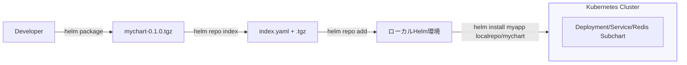

# 📦 Chapter 5: Helm Repository と Chart 管理 Hands-on

この章では、Helm Chart を「取得」「公開」「依存関係として扱う」方法を  
実際にコマンド操作しながら理解します。

---

## 🎯 目標
- Helm リポジトリを追加・検索・更新できる  
- Chart をローカルでパッケージ化し、リポジトリとして公開できる  
- 依存関係（Subchart）を `helm dependency update` で管理できる  
- Artifact Hub（公式公開サイト）を参照できる  

---

## 🧩 前提
- Helm と kind クラスタが動作している  
- 第4章までのハンズオン環境がある（`mychart/` 作成済み）  
- ネットワーク接続がある（Artifact Hub 参照用）

---

## Step 1. Helm リポジトリの操作

まず、現在登録されているリポジトリを確認します。

```bash
helm repo list
```

Bitnami リポジトリが無い場合は追加します。
```bash
helm repo add bitnami https://charts.bitnami.com/bitnami
helm repo update
```

確認：
```bash
helm search repo nginx
```

出力例：
```bash
NAME               	CHART VERSION	APP VERSION	DESCRIPTION
bitnami/nginx      	15.5.2       	1.27.0     	NGINX Open Source
```

## Step 2. Artifact Hub から Chart を探す
Artifact Hub https://artifacthub.io は、
公式の Helm Chart カタログです。

コマンドでも検索可能です：
```bash
helm search hub mysql
```

helm search repo は 登録済みリポジトリ内検索、
helm search hub は Artifact Hub 全体検索 です。

## Step 3. Chart のダウンロードと展開
```bash
helm pull bitnami/nginx --untar
```

結果：
```bash
nginx/
├── Chart.yaml
├── values.yaml
└── templates/
```

--untar を付けると .tgz を自動展開します。
Chart 構造を手元で学習・改変したいときに便利です。

## Step 4. Chart のパッケージ化
自分で作成した mychart/ を配布可能形式にします。
```bash
helm package ./mychart
```

結果：
```bash
Successfully packaged chart and saved it to: ./mychart-0.1.0.tgz
```
これが「配布可能な Helm Chart ファイル」です。
.tgz は他者に渡す、もしくはリポジトリに登録して配布します。

## Step 5. 自前のリポジトリを作成
1️⃣ Chart をまとめるディレクトリを作成：
```bash
mkdir -p myrepo
mv mychart-0.1.0.tgz myrepo/
cd myrepo
```

2️⃣ インデックスを生成：
```bash
helm repo index .
```

結果：
```bash
myrepo/
├── mychart-0.1.0.tgz
└── index.yaml
```
index.yaml には Chart の名前・バージョン・URL 情報が含まれます。

## Step 6. ローカルリポジトリとして登録・利用
```bash
# 1) リポジトリ用ディレクトリに移動
cd myrepo

# 2) index.yaml を作り直し（URLはあなたの環境に合わせて）
helm repo index . --url http://127.0.0.1:8081

# 3) 簡易HTTPサーバを起動（別ターミナルで実行）
python3 -m http.server 8081
```
別ターミナルで以下を実行：
```bash
helm repo add localrepo http://127.0.0.1:8081
helm repo update
```

確認：
```bash
helm search repo mychart
```

デプロイも可能：
```bash
helm install myapp localrepo/mychart
```
✅ file:// スキームを使えばローカルリポジトリとして扱えます。
CI/CD 用や社内リポジトリにも応用できます。

## Step 8. クリーンアップ
```bash
helm uninstall myapp
helm repo remove localrepo
```

## まとめ
| コマンド               | 機能                             |
| ---------------------- | -------------------------------- |
| helm repo add          | リポジトリを追加                 |
| helm repo list         | 登録済みリポジトリ確認           |
| helm search repo       | ローカル登録リポジトリを検索     |
| helm search hub        | Artifact Hub を検索              |
| helm pull              | Chart を取得（ダウンロード）     |
| helm package           | Chart をパッケージ化             |
| helm repo index        | 自前リポジトリのインデックス生成 |
| helm dependency update | Subchart を取得・更新            |
| helm verify            | Chart の署名を検証 |

## 補足図：リポジトリと Chart の関係
