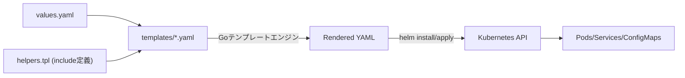

# 🧩 Chapter 6: Helm Template の高度な機能 Hands-on

Helm のテンプレート構文を理解し、条件分岐・ループ・部分テンプレート化を活用できるようにします。  
実際に Chart 内のテンプレートを編集して、 `.Values` の値を反映させながら動作を確認します。

---

## 🎯 目標
- `if`, `range`, `with` などのテンプレート構文を理解する  
- `_helpers.tpl` を使った共通パーツの再利用を体験する  
- `tpl` 関数による動的テンプレート評価を理解する  
- `.Values` のスコープと名前空間の考え方を体感する

---

## 🧩 前提
- kind クラスタ (`helm-lab`) と Helm が利用可能  
- 第2章で作成した `mychart/` ディレクトリを利用  
- デプロイ済みの場合は削除しておく  
  ```bash
  helm uninstall myapp

## Step 1. if 構文による条件分岐
templates/configmap.yaml を作成：
```yaml
apiVersion: v1
kind: ConfigMap
metadata:
  name: {{ .Chart.Name }}-config
data:
  {{- if .Values.feature.enabled }}
  feature: "enabled"
  {{- else }}
  feature: "disabled"
  {{- end }}
```

values.yaml に以下を追加：
```yaml
feature:
  enabled: true
```

動作確認：
```bash
helm template ./mychart
```
Source: mychart/templates/configmap.yaml 内で feature: "enabled" の行が出力されれば成功。  
enabled: false にして再実行すると "disabled" に変わります。

## Step 2. range 構文でループ生成
values.yaml に複数エントリを追加：
```yaml
users:
  - alice
  - bob
  - charlie
```

templates/configmap.yaml に追記：
```yaml
users: |
  {{- range .Values.users }}
    - {{ . }}
  {{- end }}
```

出力確認：
```bash
helm template ./mychart
```

結果例：
```yaml
data:
  users: |
    - alice
    - bob
    - charlie
```

## Step 3. with 構文でスコープを簡略化
values.yaml に追加：
```yaml
app:
  image: nginx
  tag: "1.27.1"
```

templates/deployment.yaml を修正：
```yaml
spec:
  containers:
    {{- with .Values.app }}
    - name: {{ .image }}
      image: "{{ .image }}:{{ .tag }}"
    {{- end }}
```

with により、.Values.app.image を .image で参照可能になります。

出力確認：
```bash
helm template ./mychart
```

結果例： Source: mychart/templates/deployments.yaml 内
```yaml
      containers:
        - name: nginx
          image: "nginx:1.27.1"
```

## Step 4. include による共通パーツ化
templates/_helpers.tpl に関数を追加(更新)：
```yaml
{{- define "mychart.fullname" -}}
{{ printf "%s-%s" .Release.Name .Chart.Name | trunc 63 | trimSuffix "-" }}
{{- end }}
```

出力確認：
```bash
helm template ./mychart
```

結果例：
```yaml
# Source: mychart/templates/service.yaml
apiVersion: v1
kind: Service
metadata:
  name: release-name-mychart
```

Helm は _helpers.tpl の中の define を include で呼び出すことができます。

## Step 5. tpl 関数による動的テンプレート評価
values.yaml に以下を追加：
```yaml
dynamic:
  message: "Hello {{ .Release.Name | upper }}"
```

templates/configmap.yaml に追記：
```yaml
data:
  dynamic_message: {{ tpl .Values.dynamic.message . | quote }}
```

出力確認：
```bash
helm template ./mychart
```

出力例：
```yaml
data:
  dynamic_message: "Hello RELEASE-NAME"
```

tpl により、values.yaml の文字列内にテンプレート式を埋め込むことが可能です。

## Step 6. required 関数で必須値を明示
templates/deployment.yaml の冒頭で必須チェックを追加：
```yaml
{{- $img := required "image.dummy.repository is required" .Values.image.dummy.repository }}
```

values.yaml に image.repository がない場合、エラーになります。

実行：
```bash
helm template ./mychart
# → Error: template: mychart/templates/deployment.yaml:3:20: executing "mychart/templates/deployment.yaml" ...
```

✅ required は「意図的に設定漏れを検知する」ために使います。
全ての値に付けるのではなく、本当に必要な設定だけに適用します。

## Step 7. Values のスコープ確認
テンプレート内で .Values の内容を確認：
```yaml
apiVersion: apps/v1
kind: Deployment
metadata:
  name: {{ include "mychart.fullname" . }}
  labels:
    {{- include "mychart.labels" . | nindent 4 }}
```
-> nindent 4

helm template を実行し、Values 全体の構造を可視化して理解します。
```bash
helm template ./mychart
```
```yaml
# Source: mychart/templates/deployment.yaml
apiVersion: apps/v1
kind: Deployment
metadata:
  name: release-name-mychart
  labels:
    helm.sh/chart: mychart-0.1.0
    app.kubernetes.io/name: mychart
    app.kubernetes.io/instance: release-name
    app.kubernetes.io/version: "1.16.0"
    app.kubernetes.io/managed-by: Helm
-> 4つ分のインデントが自動生成
```

## Step 8. クリーンアップ
```bash
helm uninstall myapp
```

## 補足図：Helm テンプレート評価の流れ


## まとめ
| 構文 / 関数               | 役割                             |
| ---------------------- | -------------------------------- |
| if / else          | 条件分岐                 |
| range         | ループ           |
| with       | スコープ切替     |
| include / _helpers.tpl        | 共通テンプレート呼び出し              |
| tpl              | 動的テンプレート評価     |
| required           | 必須値のチェック             |
| .Values        | values.yaml のデータ構造 |