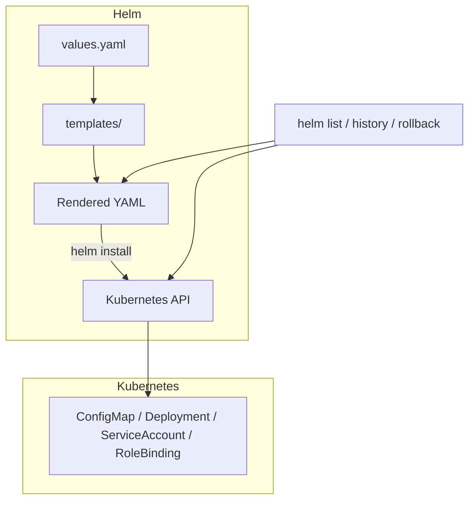

# ⚙️ Chapter 7: Helm と Kubernetes の連携・運用 Hands-on

Helm は単なるテンプレートエンジンではなく、Kubernetes 上での**アプリケーションライフサイクル管理ツール**です。  
この章では、Helm が Kubernetes とどのように連携し、運用フェーズでどう使われるかを実際に試します。

---

## 🎯 目標

- Helm の「リリース」という概念を理解する  
- Namespace を指定したデプロイを試す  
- ServiceAccount / RBAC を設定して Helm の実行権限を制御する  
- Helm リリースの更新（`upgrade`）とロールバック（`rollback`）を実行できるようにする

---

## 🧩 前提

- kind クラスタが起動済み  
- `mychart/` が存在し、`helm install myapp ./mychart` が正常に動く状態  
- Namespace 操作ができる `kubectl` 権限があること

---

## Step 1. Helm の「リリース」概念を確認する

Helm はデプロイしたアプリを「Release」として管理します。  
まずインストールして、Release 情報を見てみましょう。

```bash
helm install myapp ./mychart
helm list
```

出力例：
```bash
NAME    NAMESPACE  REVISION UPDATED                              STATUS   CHART        APP VERSION
myapp   default    1        2025-10-18 19:20:00.123456 +0900 JST deployed mychart-0.1.0  1.0
```

✅ これで Helm が「Release＝Chart のインスタンス化したもの」を管理していることがわかります。

## Step 2. Namespace を分けてデプロイ
新しい Namespace を作り、そこに Chart をデプロイします。
```bash
kubectl create namespace staging
helm install myapp-staging ./mychart -n staging
helm list -A
```

出力例：
```bash
NAME            NAMESPACE   REVISION STATUS   CHART
myapp           default     1        deployed mychart-0.1.0
myapp-staging   staging     1        deployed mychart-0.1.0
```

🔍 -n（--namespace）で Namespace を切り替えることで、同じ Chart を複数環境に独立デプロイできます。

## Step 3. ServiceAccount と RBAC の設定
Helm 実行者を限定したい場合は、専用の ServiceAccount を使います。
templates/serviceaccount.yaml を作成します。
```yaml
apiVersion: v1
kind: ServiceAccount
metadata:
  name: {{ .Release.Name }}-sa
```

values.yaml に設定を追加：
```yaml
serviceAccount:
  create: true
  name: ""
```

templates/deployment.yaml を編集して関連付け：
```yaml
spec:
  serviceAccountName: {{ include "mychart.serviceAccountName" . }}
```

_helpers.tpl に関数を追加：
```yaml
{{- define "mychart.serviceAccountName" -}}
{{- if .Values.serviceAccount.name }}
{{ .Values.serviceAccount.name }}
{{- else }}
{{ printf "%s-sa" .Release.Name }}
{{- end }}
{{- end }}
```

動作確認：
```bash
helm install myapp ./mychart --set serviceAccount.create=true
kubectl get sa
```

✅ myapp-sa が作成されていれば成功です。

## Step 4. RBAC (Role & RoleBinding) の追加
templates/role.yaml を作成：
```yaml
apiVersion: rbac.authorization.k8s.io/v1
kind: Role
metadata:
  name: {{ .Release.Name }}-role
rules:
  - apiGroups: [""]
    resources: ["pods"]
    verbs: ["get", "list"]
```

templates/rolebinding.yaml：
```yaml
apiVersion: rbac.authorization.k8s.io/v1
kind: RoleBinding
metadata:
  name: {{ .Release.Name }}-rolebinding
subjects:
  - kind: ServiceAccount
    name: {{ include "mychart.serviceAccountName" . }}
roleRef:
  kind: Role
  name: {{ .Release.Name }}-role
  apiGroup: rbac.authorization.k8s.io
```

確認：
```bash
helm install myapp-rbac ./mychart
kubectl get role,rolebinding
```

## Step 5. Helm upgrade と rollback
アプリを更新してバージョンを上げてみましょう。
```bash
helm upgrade myapp ./mychart --set feature.enabled=false
helm history myapp
```

出力例：
```yaml
REVISION  UPDATED                         STATUS     CHART        DESCRIPTION
1         2025-10-18 19:20:00.123456 JST deployed   mychart-0.1.0 Install complete
2         2025-10-18 19:25:43.891234 JST superseded mychart-0.1.0 Upgrade complete
```

ロールバック：
```bash
helm rollback myapp 1
helm history myapp
```

✅ Rollback で以前のリリースに即復旧できるのが Helm の強みです。

## Step 6. クリーンアップ
```bash
helm uninstall myapp
helm uninstall myapp-staging -n staging
kubectl delete namespace staging
```

## まとめ
| 機能               | コマンド例                       | 説明                                 |
| ------------------ | -------------------------------- | ------------------------------------ |
| リリース管理       | helm list                        | Helm がデプロイを Release として管理 |
| Namespace 切替     | helm install -n staging          | 環境ごとに分離                       |
| ServiceAccount     | --set serviceAccount.create=true | 実行権限の分離                       |
| v                  | Role / RoleBinding               | Helm リリース専用の権限管理          |
| 更新とロールバック | helm upgrade / helm rollback     | 継続的デプロイに必須 |

## 補足図：Helm リリースと Kubernetes リソースの関係
