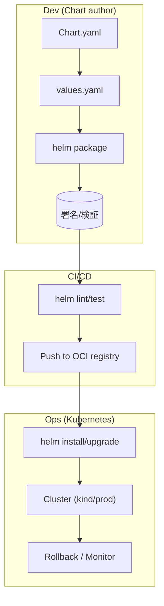

# 🚀 Chapter 8: Helm の拡張と実践応用 Hands-on

この章では、Helm の運用をより発展させるための拡張・自動化・セキュリティを体験します。  
Helmfile や CI/CD、署名・検証、Chart テストなど、実運用に即した流れを通して学びます。

---

## 🎯 目標
- Helmfile を使って複数環境の Chart を一括管理する  
- Chart のテストと Hooks を活用する  
- Chart の署名と検証（概念）を理解する  
- ベストプラクティスによる安全な運用手法を知る

---

## 🧩 前提
- kind クラスタ稼働中  
- Helm CLI 利用可 (`helm version`)  
- 第5〜7章で作成した `mychart/` がある状態

---

### ⚠️ Step 0. Helmfile のインストール（事前準備）

1. Helmfile をインストールします（環境によって方法が異なります）  
```bash
# 例：Linux バイナリ版
wget https://github.com/helmfile/helmfile/releases/download/v0.159.0/helmfile_0.159.0_linux_amd64.tar.gz
tar -zxvf helmfile_0.159.0_linux_amd64.tar.gz
sudo mv helmfile /usr/local/bin/
chmod +x /usr/local/bin/helmfile
```

インストール後、バージョンを確認します。
```bash
helmfile --version
```

## Step 1. Helmfile による一括管理

Helmfile は、複数の Helm リリースを一括管理できるツールです。
1. リポジトリ用ファイルを用意
```bash
mkdir -p repo
helm package ./mychart -d repo/
helm repo index repo --url http://127.0.0.1:8081
```

2. 簡易HTTPサーバを起動（別ターミナル）
```bash
cd repo
python3 -m http.server 8081
```

3. `helmfile.yaml` を作成
```yaml
repositories:
  - name: localrepo
    url: http://127.0.0.1:8081

releases:
  - name: myapp
    namespace: default
    chart: ./mychart
    values:
      - ./mychart/values-prod.yaml
```
Helmfile により「複数の環境にまたがる Helm 管理」を YAML で定義できます。

実行
```bash
helmfile repos
helmfile sync
```

出力例：
```bash
Building dependency release=myapp
Upgrading release=myapp, chart=mychart
```

## Step 2. Hook によるデプロイ前後処理
templates/hooks-job.yaml を作成：
```yaml
apiVersion: batch/v1
kind: Job
metadata:
  name: {{ .Release.Name }}-precheck
  annotations:
    "helm.sh/hook": pre-install
spec:
  template:
    spec:
      containers:
        - name: precheck
          image: busybox
          command: ['sh', '-c', 'echo "Pre-install check OK"']
      restartPolicy: Never
```

確認：
```bash
helm upgrade --install myapp ./mychart
helm get hooks
```

出力：
```bash
# Source: mychart/templates/hooks-job.yaml
apiVersion: batch/v1
kind: Job
metadata:
  name: myapp-precheck
  annotations:
    "helm.sh/hook": pre-install
spec:
  template:
    spec:
      containers:
        - name: precheck
          image: busybox
          command: ['sh', '-c', 'echo "Pre-install check OK"']
      restartPolicy: Never
```

✅ helm.sh/hook アノテーションを指定することで、
pre-install, post-install, pre-delete などのタイミングで処理を追加できます。

## Step 3. Helm Test で動作確認ジョブを実行
templates/test-connection.yaml：
```yaml
apiVersion: v1
kind: Pod
metadata:
  name: "{{ .Release.Name }}-test-connection"
  annotations:
    "helm.sh/hook": test
spec:
  containers:
    - name: curl
      image: curlimages/curl
      command: ['curl', '-f', 'http://myapp:80']
  restartPolicy: Never
```

実行：
```bash
helm test myapp
```

出力例：
```bash
NAME: myapp
LAST DEPLOYED: Sun Oct 19 19:17:22 2025
NAMESPACE: default
STATUS: deployed
REVISION: 1
TEST SUITE:     myapp-mychart-test-connection
Last Started:   Sun Oct 19 19:24:07 2025
Last Completed: Sun Oct 19 19:24:11 2025
Phase:          Succeeded
```

✅ Chart の品質チェックを自動化する際に利用できます。

## Step 4. Chart の署名・検証（概念理解）
※署名コマンドは環境依存のため、ここでは動作確認を行わず「考え方」を学びます。

Helm では以下の2つで Chart の信頼性を確保します：

| 機能 | コマンド例                    | 説明                    |
| ---- | ----------------------------- | ----------------------- |
| 署名 | helm package --sign           | Chart に GPG 署名を付与 |
| 検証 | helm verify mychart-0.1.0.tgz | .prov ファイルと鍵で検証 |

💡現実的には、Helm 署名よりも「OCIレジストリ + cosign」や「Gitタグ署名」で代替されるケースが多いです。

## Step 5. Helm のベストプラクティス（運用チェックリスト）
| 分類         | ベストプラクティス                            | ポイント             |
| ------------ | --------------------------------------------- | -------------------- |
| Chart 設計   | _helpers.tpl に共通関数を集約                 | メンテナンス容易化   |
| Values       | values-prod.yaml / values-staging.yaml の分離 | 環境ごとの設定を明示 |
| Template     | required で必須値を明示                       | エラーを早期検知     |
| Version 管理 | Chart.yaml の version を厳密に管理            | CI/CD の安定化       |
| セキュリティ | RBAC と ServiceAccount の原則最小権限         | 特権昇格を防止       |
| リリース運用 | upgrade --atomic / rollback を活用            | 障害時の即時復旧     |
| 監査         | helm lint / helm test の自動実行              | 品質保証の一環 |

## Step 6. CI/CD パイプラインへの組み込み（概要）
GitHub Actions や Jenkins を使う場合、
Chart のビルドと配布を自動化できます。

例: .github/workflows/helm-release.yml
```yaml
name: Helm Release
on:
  push:
    branches: [ main ]
jobs:
  release:
    runs-on: ubuntu-latest
    steps:
      - uses: actions/checkout@v3
      - name: Setup Helm
        uses: azure/setup-helm@v3
      - name: Lint Chart
        run: helm lint ./mychart
      - name: Package and Push
        run: |
          helm package ./mychart
          helm push mychart-*.tgz oci://ghcr.io/your-org/charts
```

## 補足図：Helm 実運用の全体像


## Step 7. クリーンアップ
```bash
helm uninstall myapp
helmfile destroy  # Helmfile を使っている場合
```

### まとめ
| テーマ             | 学び                            |
| ------------------ | ------------------------------- |
| Helmfile           | 複数環境を一括管理できる        |
| Hook               | デプロイ前後に Job を差し込める |
| Test               | Chart の品質チェックを自動化    |
| 署名・検証         | 改ざん防止・信頼性確保          |
| ベストプラクティス | 安全で再現性ある運用を実現 |