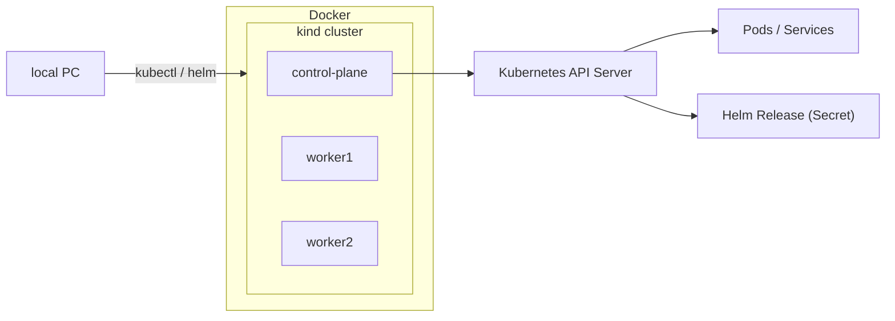

# Helm Hands-on 環境構築ガイド（kind 版）
## 目的

この手順では、Helm ハンズオンを実施するために
Docker 上で動作する軽量 Kubernetes クラスタ（kind） を構築し、
Helm コマンドを実行できる環境を整備します。

## 前提条件
| 項目          | 推奨バージョン                                | 備考                          |
| ------------- | --------------------------------------------- | ----------------------------- |
| OS            | Ubuntu 20.04 / 22.04 / macOS / Windows (WSL2) | Docker が動作すること         |
| Docker Engine | 20.10 以上                                    | kind が利用                   |
| kubectl       | 1.25 以上                                     | kind と互換性あり             |
| kind          | 0.22 以上                                     | Kubernetes クラスタ構築に使用 |
| Helm          | 3.13 以上                                     | v3 系推奨（Tiller 不要） |

## 1.必要ツールのインストール
▶ Docker

インストール済みでない場合は、以下を参考にセットアップ：
```bash
sudo apt update
sudo apt install -y docker.io
sudo systemctl enable --now docker
sudo usermod -aG docker $USER
```

再ログイン後に確認：
```bash
docker run hello-world
```

▶ kubectl
```bash
curl -LO "https://dl.k8s.io/release/$(curl -Ls https://dl.k8s.io/release/stable.txt)/bin/linux/amd64/kubectl"
sudo install -o root -g root -m 0755 kubectl /usr/local/bin/kubectl
kubectl version --client
```

▶ Helm
```bash
curl https://raw.githubusercontent.com/helm/helm/main/scripts/get-helm-3 | bash
helm version
```

## 2. kind クラスタの構築
▶ 単一ノードクラスタ（最小構成）
```bash
kind create cluster --name helm-lab
```

▶ 複数ノード構成（本番構成に近い構成例）
```bash
kind-multi-node.yaml
```

```yaml
kind: Cluster
apiVersion: kind.x-k8s.io/v1alpha4
nodes:
  - role: control-plane
  - role: worker
  - role: worker
```

作成：
```bash
kind create cluster --name helm-lab --config kind-multi-node.yaml
```

確認：
```bash
kubectl get nodes
```

## 3. Helm 初期設定の確認
▶ リポジトリの追加
```bash
helm repo add bitnami https://charts.bitnami.com/bitnami
helm repo update
```

▶ テストデプロイ（nginx）
```bash
helm install test-nginx bitnami/nginx
kubectl get pods
```

ブラウザアクセス（NodePort利用）:
```bash
kubectl port-forward svc/test-nginx 8080:80
```
→ http://localhost:8080
 で “Welcome to nginx!” を確認できれば成功。

## 4. Helm クラスタ状態の確認
```bash
helm list
helm status test-nginx
```

出力例：
```sql
NAME        	NAMESPACE	REVISION	UPDATED                                	STATUS  	CHART      	APP VERSION
test-nginx   	default  	1       	2025-10-15 21:04:02.123456 +0900 JST  	deployed	nginx-15.5.2	1.27.0
```

## 5.クリーンアップ
```bash
helm uninstall test-nginx
kind delete cluster --name helm-lab
```

## 6. セットアップ完了チェックリスト
| チェック項目       | 確認コマンド        | 結果                           |
| ------------------ | ------------------- | ------------------------------ |
| kind クラスタ起動  | kubectl get nodes   | control-plane, worker が READY |
| Helm 動作確認      | helm version        | v3.x.x が表示される            |
| nginx デプロイ成功 | kubectl get pods    | STATUS=Running                 |
| アクセス確認       | curl localhost:8080 | nginx 応答あり |

## 補足：MermaidJS 図（全体アーキテクチャ）
